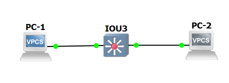
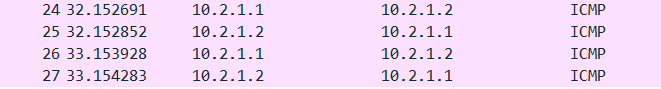
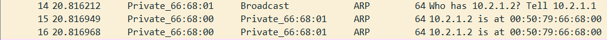
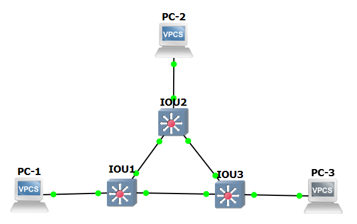
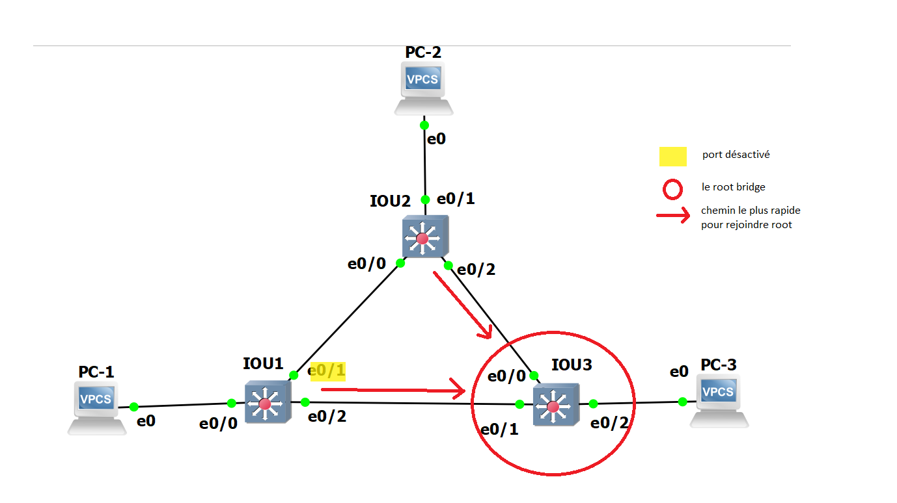
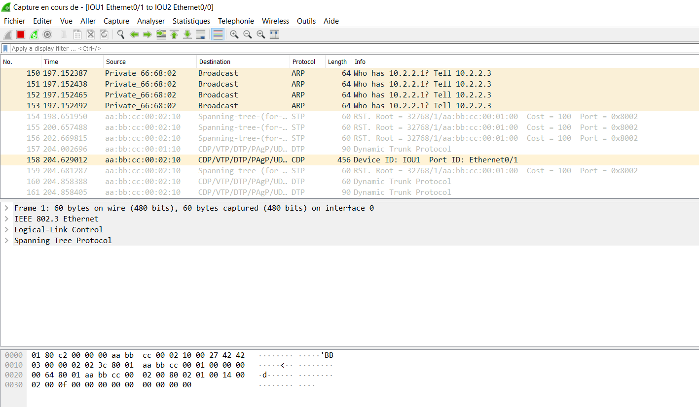
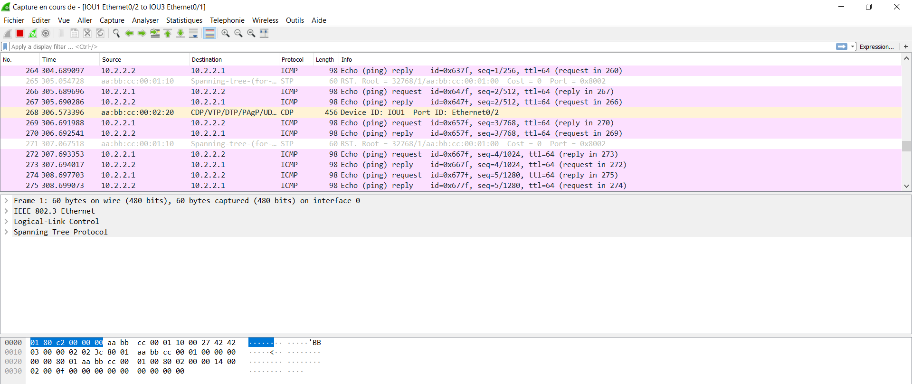
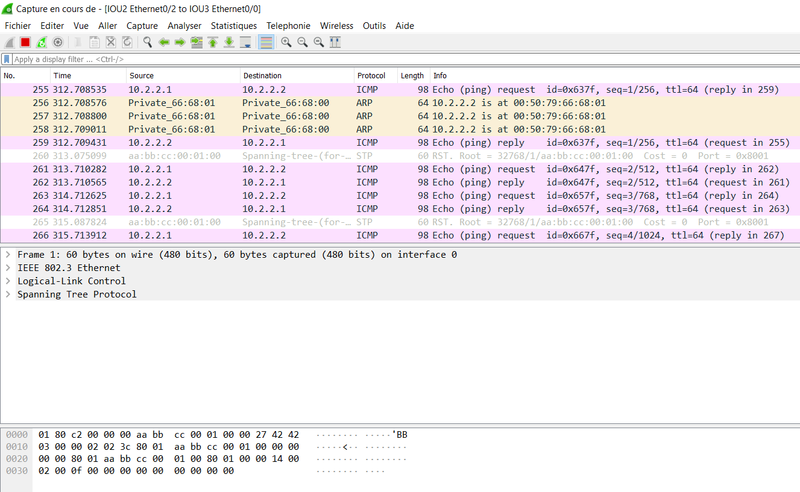
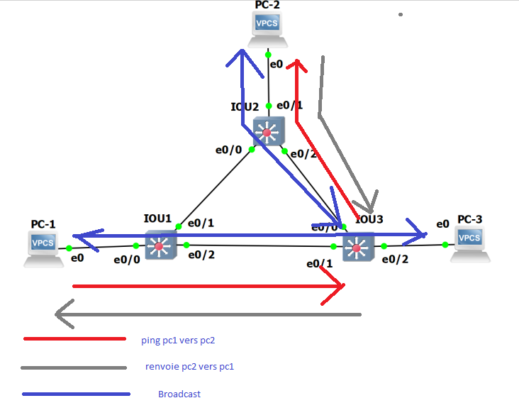

# TP2 : Network low-level, Switching


# I. Simplest setup

#### Topologie

```
+-----+        +-------+        +-----+
| PC1 +--------+  SW1  +--------+ PC2 |
+-----+        +-------+        +-----+
```

#### Plan d'adressage

Machine | `net1`
--- | ---
`PC1` | `10.2.1.1/24`
`PC2` | `10.2.1.2/24`

#### ToDo

* 🌞 mettre en place la topologie ci-dessus  

  

* 🌞 faire communiquer les deux PCs  

PC1 qui `ping` PC2 :

  ```bash
  PC-1> ping 10.2.1.2/24
  84 bytes from 10.2.1.2 icmp_seq=1 ttl=64 time=0.189 ms
  84 bytes from 10.2.1.2 icmp_seq=2 ttl=64 time=0.349 ms
  84 bytes from 10.2.1.2 icmp_seq=3 ttl=64 time=0.452 ms
  84 bytes from 10.2.1.2 icmp_seq=4 ttl=64 time=0.353 ms
  84 bytes from 10.2.1.2 icmp_seq=5 ttl=64 time=0.340 ms
  ```  
PC2 qui `ping` PC1 :  
```bash
PC-2> ping 10.2.1.1/24
84 bytes from 10.2.1.1 icmp_seq=1 ttl=64 time=0.185 ms
84 bytes from 10.2.1.1 icmp_seq=2 ttl=64 time=0.369 ms
84 bytes from 10.2.1.1 icmp_seq=3 ttl=64 time=0.344 ms
```  

  * déterminer le protocole utilisé par `ping` à l'aide de Wireshark 

      Le protocole utilisé est ICMP

      PC1 `ping` PC2 : 

       

      PC2 `ping` PC1 :  

      

  * analyser les échanges ARP
    * utiliser Wireshark et mettre en évidence l'échange ARP entre les deux machines (`ARP Request` et `ARP Reply`)  
      

    * corréler avec les tables ARP des différentes machines
      ```bash
      PC-1> arp
      00:50:79:66:68:00  10.2.1.2 expires in 113 seconds
      ```

      ```bash
      PC-2> arp
      00:50:79:66:68:01  10.2.1.1 expires in 84 seconds
      ```
* 🌞 récapituler toutes les étapes (dans le compte-rendu, à l'écrit) quand `PC1` exécute `ping PC2` pour la première fois
  * échanges ARP   
  Quand le PC1 ping le PC2 pour la première fois, 3 lignes ARP s'affichent dans le Wireshark : 1 request et 2 reply. Le protocole ARP permet de récupérer l'addresse Mac du PC2 pour pouvoir communiquer avec lui.  
  Request = la demande du PC1 vers le PC2   
  Reply = la réponse du PC2 vers le PC1

  * échange `ping`  
  Pour ce qui est de l'échange de ping, le protocole utilisé est ICMP 
* 🌞 expliquer...
  * pourquoi le switch n'a pas besoin d'IP   
    ```bash
    Car il transmet juste les messages  
    ```
  * pourquoi les machines ont besoin d'une IP pour pouvoir se `ping`  
    ```bash
    Pour savoir à qui distribuer les paquets
    ```

# II. More switches


#### ToDo

* 🌞 mettre en place la topologie ci-dessus



* 🌞 faire communiquer les trois PCs
  * avec des `ping` qui fonctionnent

PC1 vers PC2  

  ```bash
  PC-1> ping 10.2.2.1/24
  10.2.2.1 icmp_seq=1 ttl=64 time=0.001 ms
  10.2.2.1 icmp_seq=2 ttl=64 time=0.001 ms
  10.2.2.1 icmp_seq=3 ttl=64 time=0.001 ms
  ```

PC1 vers PC3   

  ```bash
  PC-1> ping 10.2.2.3/24
  84 bytes from 10.2.2.3 icmp_seq=1 ttl=64 time=0.330 ms
  84 bytes from 10.2.2.3 icmp_seq=2 ttl=64 time=0.517 ms
  ```

PC2 vers PC1 

```bash
PC-2> ping 10.2.2.1/24
84 bytes from 10.2.2.1 icmp_seq=1 ttl=64 time=0.833 ms
84 bytes from 10.2.2.1 icmp_seq=2 ttl=64 time=0.771 ms
```

PC2 vers PC3  

```bash
PC-2> ping 10.2.2.3/24
84 bytes from 10.2.2.3 icmp_seq=1 ttl=64 time=0.334 ms
84 bytes from 10.2.2.3 icmp_seq=2 ttl=64 time=0.602 ms
```

PC3 vers PC1

```bash
PC-3> ping 10.2.2.1/24
84 bytes from 10.2.2.1 icmp_seq=1 ttl=64 time=0.578 ms
84 bytes from 10.2.2.1 icmp_seq=2 ttl=64 time=0.581 ms
```

PC3 vers PC2

```bash
PC-3> ping 10.2.2.2/24
84 bytes from 10.2.2.2 icmp_seq=1 ttl=64 time=0.525 ms
84 bytes from 10.2.2.2 icmp_seq=2 ttl=64 time=0.561 ms
```

* 🌞 analyser la table MAC d'un switch
  * `show mac address-table`
```bash
  IOU1#show mac address-table
            Mac Address Table
  -------------------------------------------

  Vlan    Mac Address       Type        Ports
  ----    -----------       --------    -----
    1    0050.7966.6800    DYNAMIC     Et0/0
    1    0050.7966.6801    DYNAMIC     Et0/2
    1    0050.7966.6802    DYNAMIC     Et0/2
    1    aabb.cc00.0110    DYNAMIC     Et0/2
    1    aabb.cc00.0300    DYNAMIC     Et0/1
    1    aabb.cc00.0320    DYNAMIC     Et0/2
  Total Mac Addresses for this criterion: 6
```

  * comprendre/expliquer chaque ligne  
  
  En faisant `show mac address-table` on voit les machines qui sont connectées à ce switch.  
  On voit aussi les deux autres switch du réseau avec les machines de chacun (avec leur MAC adresse).

  * 🐙 en lançant Wireshark sur les liens des switches, il y a des trames CDP qui circulent. Quoi qu'est-ce ?  
 Les trames du protocole CDP contiennent des informations sur les propriétés du port, connexion et/ou périphérique.


On va regarder comment STP a été configuré.

* 🌞 déterminer les informations STP  


  ```bash 
  IOU1#show spanning-tree

  VLAN0001
    Spanning tree enabled protocol rstp
    Root ID    Priority    32769
              Address     aabb.cc00.0100
              Cost        100
              Port        3 (Ethernet0/2)
              Hello Time   2 sec  Max Age 20 sec  Forward Delay 15 sec

    Bridge ID  Priority    32769  (priority 32768 sys-id-ext 1)
              Address     aabb.cc00.0200
              Hello Time   2 sec  Max Age 20 sec  Forward Delay 15 sec
              Aging Time  300 sec

  Interface           Role Sts Cost      Prio.Nbr Type
  ------------------- ---- --- --------- -------- --------------------------------
  Et0/0               Desg FWD 100       128.1    Shr
  Et0/1               Desg FWD 100       128.2    Shr
  Et0/2               Root FWD 100       128.3    Shr
  Et0/3               Desg FWD 100       128.4    Shr
  Et1/0               Desg FWD 100       128.5    Shr
  Et1/1               Desg FWD 100       128.6    Shr
  Et1/2               Desg FWD 100       128.7    Shr
  Et1/3               Desg FWD 100       128.8    Shr
  Et2/0               Desg FWD 100       128.9    Shr
  ```

  ```bash
  show spanning-tree bridge

                                                    Hello  Max  Fwd
  Vlan                         Bridge ID              Time  Age  Dly  Protocol
  ---------------- --------------------------------- -----  ---  ---  --------
  VLAN0001         32769 (32768,   1) aabb.cc00.0200    2    20   15  rstp
  ```

  ```bash
    IOU1#show spanning-tree summary
  Switch is in rapid-pvst mode
  Root bridge for: none
  Extended system ID                      is enabled
  Portfast Default                        is disabled
  Portfast Edge BPDU Guard Default        is disabled
  Portfast Edge BPDU Filter Default       is disabled
  Loopguard Default                       is disabled
  PVST Simulation Default                 is enabled but inactive in rapid-pvst mode
  Bridge Assurance                        is enabled
  EtherChannel misconfig guard            is enabled
  Configured Pathcost method used is short
  UplinkFast                              is disabled
  BackboneFast                            is disabled

  Name                   Blocking Listening Learning Forwarding                                               STP Active
  ---------------------- -------- --------- -------- ----------                                               ----------
  VLAN0001                     0         0        0         16                                                16
  ---------------------- -------- --------- -------- ----------                                               ----------
  1 vlan                       0         0        0         16   
  ```
* 🌞 faire un schéma en représentant les informations STP
  * rôle des switches (qui est le root bridge)
  * rôle de chacun des ports
      

* 🌞 confirmer les informations STP
  * effectuer un `ping` d'une machine à une autre
  * vérifier que les trames passent bien par le chemin attendu (Wireshark)  
  IOU1 vers IOU2 le protocole STP a désactivé le lien.
     
  En regardant les autres liaisons on voit que la trame passe du switch 1 au switch 3 puis du switch 3 au switch 2 pour aller au PC2.
     
    


* 🌞 faire un schéma qui explique le trajet d'une requête ARP lorsque PC1 ping PC3, et de sa réponse
  * représenter **TOUTES** les trames ARP (n'oubliez pas les broadcasts)
     
#### Reconfigurer STP

* 🌞 changer la priorité d'un switch qui n'est pas le *root bridge*  

On donne la priorité au IOU1

```bash
IOU1(config)#spanning-tree vlan 1 priority 4096
IOU1(config)#^Z
IOU1#
*Oct 16 21:09:00.377: %SYS-5-CONFIG_I: Configured from console by console
```


* 🌞 vérifier les changements
  * avec des commandes sur les switches  
  grâce à cette commande je vois quelle interface est bloquée, c'est le switch 2 et le port eO/2.
  ```bash
      IOU2#show spanning-tree

    VLAN0001
      Spanning tree enabled protocol rstp
      Root ID    Priority    4097
                Address     aabb.cc00.0200
                Cost        100
                Port        1 (Ethernet0/0)
                Hello Time   2 sec  Max Age 20 sec  Forward Delay 15 sec

      Bridge ID  Priority    32769  (priority 32768 sys-id-ext 1)
                Address     aabb.cc00.0300
                Hello Time   2 sec  Max Age 20 sec  Forward Delay 15 sec
                Aging Time  300 sec

    Interface           Role Sts Cost      Prio.Nbr Type
    ------------------- ---- --- --------- -------- --------------------------------
    Et0/0               Root FWD 100       128.1    Shr
    Et0/1               Desg FWD 100       128.2    Shr
    Et0/2               Altn BLK 100       128.3    Shr
    Et0/3               Desg FWD 100       128.4    Shr
    Et1/0               Desg FWD 100       128.5    Shr
    Et1/1               Desg FWD 100       128.6    Shr
    Et1/2               Desg FWD 100       128.7    Shr
    Et1/3               Desg FWD 100       128.8    Shr
    Et2/0               Desg FWD 100       128.9    Shr
    Et2/1               Desg FWD 100       128.10   Shr
    Et2/2               Desg FWD 100       128.11   Shr
    Et2/3               Desg FWD 100       128.12   Shr
    Et3/0               Desg FWD 100       128.13   Shr
  ```

# III. Isolation

#### ToDo

* 🌞 mettre en place la topologie ci-dessus
  * voir [les commandes dédiées à la manipulation de VLANs](/memo/cli-cisco.md#vlan)
* 🌞 faire communiquer les PCs deux à deux
  * vérifier que `PC2` ne peut joindre que `PC3`
  * vérifier que `PC1` ne peut joindre personne alors qu'il est dans le même réseau (sad)

## 2. Avec trunk

#### ToDo

* 🌞 mettre en place la topologie ci-dessus
* 🌞 faire communiquer les PCs deux à deux
  * vérifier que `PC1` ne peut joindre que `PC3`
  * vérifier que `PC4` ne peut joindre que `PC2`

Topologie:   
```bash
PC1: VLAN 10 / 10.2.10.1/24
PC2: VLAN 20 / 10.2.20.1/24
PC3: VLAN 10 / 10.2.10.2/24
PC4: VLAN 20 / 10.2.20.2/24
```

Communication de PC1 à PC3 et PC2 à PC4  
`ping` PC1 à PC3:
```bash 
PC1> ping 10.2.10.2
84 bytes from 10.2.10.2 icmp_seq=1 ttl=64 time=0.867 ms
84 bytes from 10.2.10.2 icmp_seq=2 ttl=64 time=0.659 ms
84 bytes from 10.2.10.2 icmp_seq=3 ttl=64 time=0.717 ms
```

Communication de PC1 à PC4 ne fonctionne pas.

```bash
PC1> ping 10.2.20.2
host (10.2.20.2) Not reachable
```
Communication de PC1 à PC2 ne fonctionne pas.
```bash
PC1> ping 10.2.20.1
host (10.2.20.1) Not reachable
```